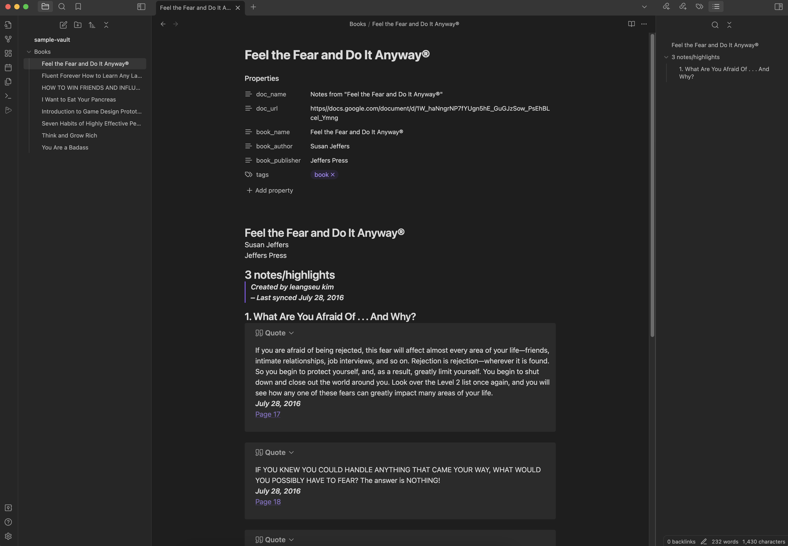

## Obsidian Google Book Highlight Sync

Sync your google book highlight from google docs to obsidian

### Features

- Sync google book highlight from you google drive to obsidian

### Getting started

- To setup google client id/secret follow https://yukigasai.github.io/obsidian-google-calendar/Setup but instead of `Google Calendar API`, you should enable `Google Drive API`

### Developer

- `yarn dev`
- open `sample-vault` with obsidian all of the change should be hot reload

### Thank you to the following plugins

- https://github.com/YukiGasai/obsidian-google-calendar
- https://github.com/liamcain/obsidian-periodic-notes
- https://github.com/AnandChowdhary/docs-markdown
